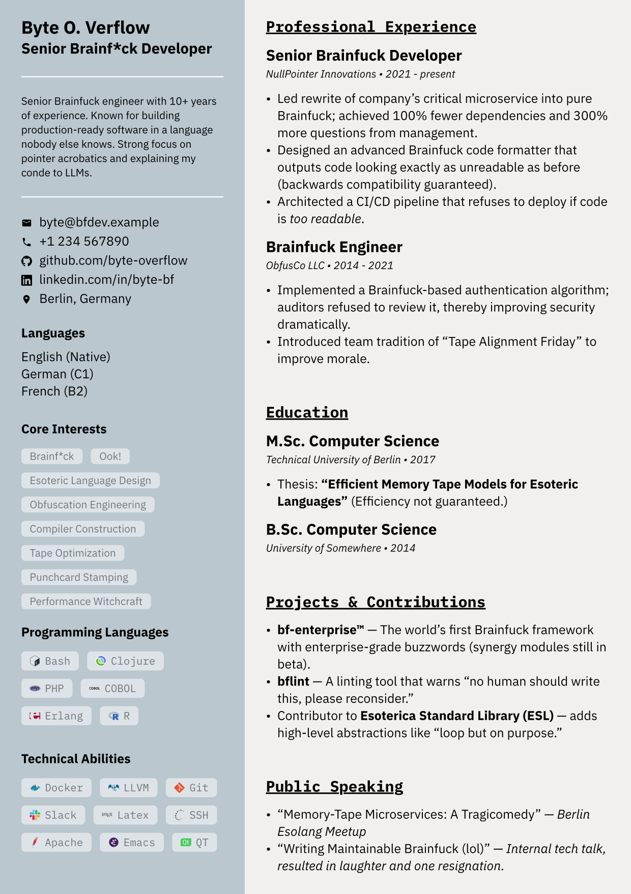

# metronic-neo

A clean, colorful Typst CV template with a two-column sidebar layout.



## Installation

metronic-neo is not yet on Typst Universe. Install it locally by cloning this repository directly into your Typst local packages directory.

**macOS**
```sh
git clone https://github.com/inverted-tree/metronic-neo-cv \
  "$HOME/Library/Application Support/typst/packages/local/metronic-neo"
```

**Linux**
```sh
git clone https://github.com/inverted-tree/metronic-neo-cv \
  "${XDG_DATA_HOME:-$HOME/.local/share}/typst/packages/local/metronic-neo"
```

**Windows**
```powershell
git clone https://github.com/inverted-tree/metronic-neo-cv `
  "$env:APPDATA\typst\packages\local\metronic-neo"
```

Then import the package in your Typst document:

```typst
#import "@local/metronic-neo:0.1.1": *
```

## Fonts

The template requires the **IBM Plex** font family. Download it from the [IBM Plex releases page](https://github.com/IBM/plex/releases) and install it system-wide, or place the TTF files in your project directory.

## Usage

See [`0.1.1/README.md`](0.1.1/README.md) for the full component reference, and [`0.1.1/template/main.typ`](0.1.1/template/main.typ) for a complete example.
